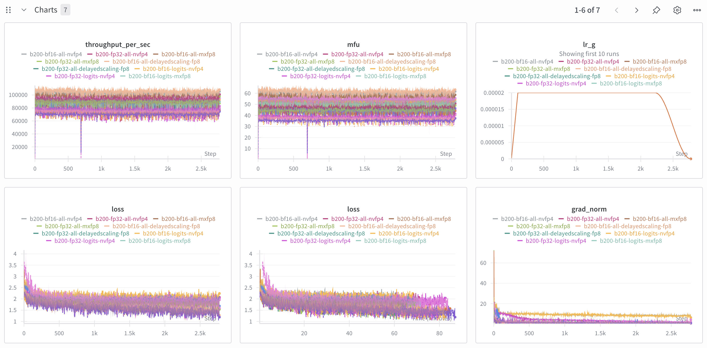

# small-malaysian-lm-B200

We want to compare how good Qwen3-1.7B-Base using B200 to continue pretraining on Malaysian multi-lingual corpus on different mixed precision training with proper truncated multi-packing.

## Manipulated variables

We want to compare,

1. FP32 weight, BF16 activation.
2. BF16 weight, BF16 activation.
3. FP32 weight, all linear layers converted to TransformerEngine DelayedScaling recipe FP8 except logits, BF16 activation.
4. BF16 weight, all linear layers converted to TransformerEngine DelayedScaling recipe FP8 except logits, BF16 activation.
5. FP32 weight, all linear layers converted to TransformerEngine MXFP8 recipe FP8 except logits, BF16 activation.
6. BF16 weight, all linear layers converted to TransformerEngine MXFP8 recipe FP8 except logits, BF16 activation.
7. FP32 weight, all linear layers converted to TransformerEngine NVFP4 recipe FP4 except logits, BF16 activation.
8. BF16 weight, all linear layers converted to TransformerEngine NVFP4 recipe FP4 except logits, BF16 activation.
9. FP32 weight, all linear layers converted to TransformerEngine DelayedScaling recipe FP8, BF16 activation.
10. BF16 weight, all linear layers converted to TransformerEngine DelayedScaling recipe FP8, BF16 activation.
11. FP32 weight, all linear layers converted to TransformerEngine MXFP8 recipe FP8, BF16 activation.
12. BF16 weight, all linear layers converted to TransformerEngine MXFP8 recipe FP8, BF16 activation.
13. FP32 weight, all linear layers converted to TransformerEngine NVFP4 recipe FP4, BF16 activation.
14. BF16 weight, all linear layers converted to TransformerEngine NVFP4 recipe FP4, BF16 activation.
15. FP32 weight, all linear, layer norm and rms norm layers converted to TransformerEngine DelayedScaling recipe FP8, BF16 activation.
16. BF16 weight, all linear, layer norm and rms norm layers converted to TransformerEngine DelayedScaling recipe FP8, BF16 activation.
17. FP32 weight, all linear, layer norm and rms norm layers converted to TransformerEngine MXFP8 recipe FP8, BF16 activation.
18. BF16 weight, all linear, layer norm and rms norm layers converted to TransformerEngine MXFP8 recipe FP8, BF16 activation.
19. FP32 weight, all linear, layer norm and rms norm layers converted to TransformerEngine NVFP4 recipe FP4, BF16 activation.
20. BF16 weight, all linear, layer norm and rms norm layers converted to TransformerEngine NVFP4 recipe FP4, BF16 activation.

## Why we no longer try to train on 5090

1. Linear layer provided not yet support to backward, https://github.com/NVIDIA/TransformerEngine/issues/1654
2. MXFP8 recipe not possible, https://github.com/NVIDIA/TransformerEngine/blob/main/transformer_engine/pytorch/quantization.py#L63
3. NVFP4 recipe not yet ready, NVIDIA/TransformerEngine#2255

## Important parameters

1. Only Malaysia Malay Wikipedia with total 90955776 tokens based on Qwen3 tokenizer.
2. 131072 token batch size, one batch size is 4096 tokens, so 32 batch size to achieve 131072 tokens.
3. 100 warmup with 2e-5 warmup-stable-decay schedule.
4. Fused AdamW optimizer.
5. Because we are using B200s, we are only able to do BF16 Flash Attention 2 v2.8.3 out of the box for now, currently Flash Attention 2 is the fastest based on our benchmarked varlen causal self-attention at [Scicom-AI-Enterprise-Organization/self-attention-benchmark-B200](https://github.com/Scicom-AI-Enterprise-Organization/self-attention-benchmark-B200).
6. Liger Kernel for `swiglu`, `rms_norm` and `fused_linear_cross_entropy`, **set `rope=True` caused NaN for torch compile**.
7. Single GPU, feel free to add DDP by your own.
8. Torch compile but with some broken recompiles limit, still improved MFU.
9. 1 epoch only.

## How to

1. Prepare the data, run [notebook/prepare-dataset.ipynb](notebook/prepare-dataset.ipynb).

Or you can just clone,

```bash
HF_HUB_ENABLE_HF_TRANSFER=0 hf download Scicom-intl/mosaic-ms-wikipedia-2023-10-01 --repo-type=dataset --local-dir=./multipacking
```

2. Run the finetuning, eg, FP32 weight, BF16 activation,

```bash
bash b200-fp32-bf16.sh
```

## WanDB

We also recorded MFU and Throughput per second, WanDB project at https://wandb.ai/aies-scicom-scicom-ai/small-malaysian-lm



We also dumped all the records from WanDB, [wandb-dump.zip](wandb-dump.zip).

### Conclusion

1. Generally about TransformerEngine mixed precision, the low precision only happened during computation, it will upcast back later, means that from HBM to SRAM still the actual precision.
2. Low precision mixed precision training able to reduced memory footprint and improved the throughput.
3. Software stacks and kernel libraries (e.g., FlashAttention, Transformer Engine, cuBLAS) are still catching up, not all workloads yet fully exploit the new Blackwell potential.